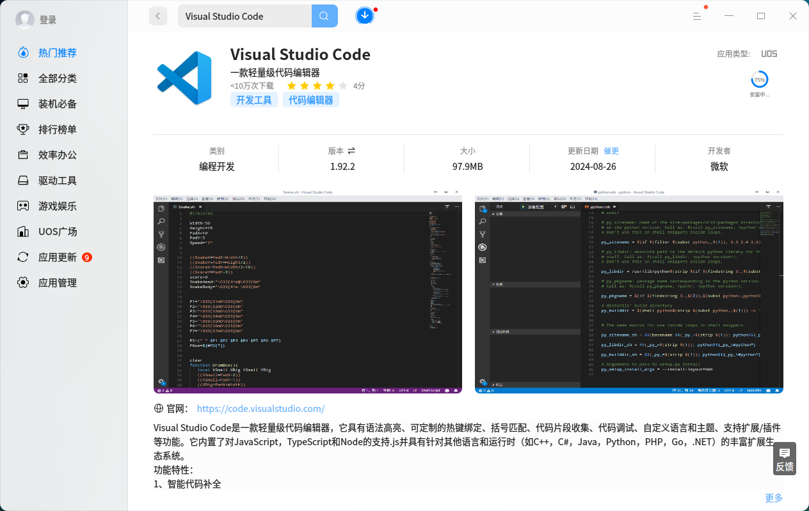
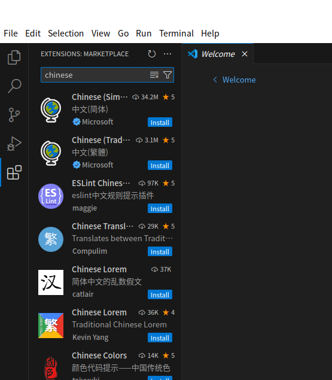
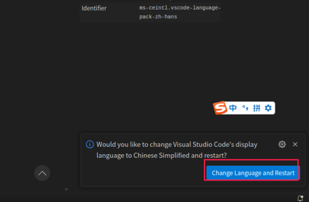
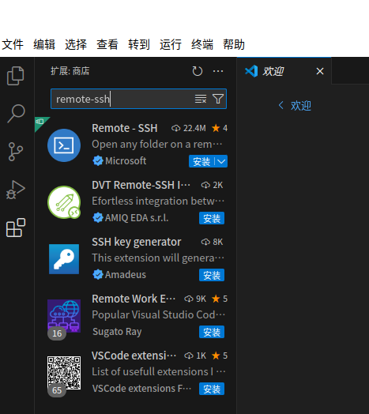
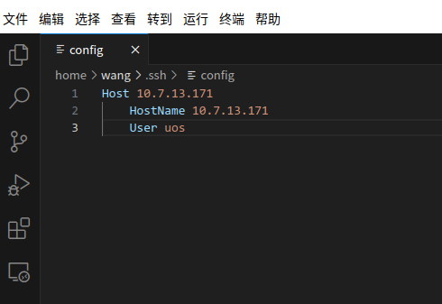
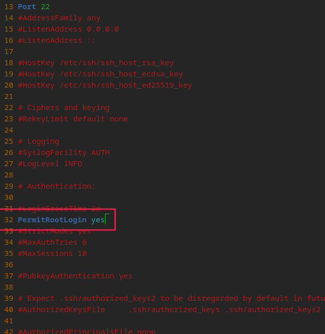
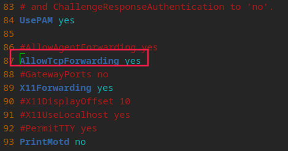
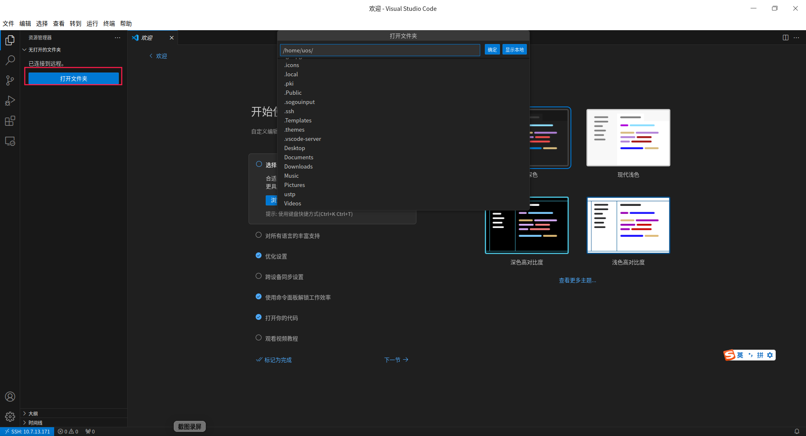
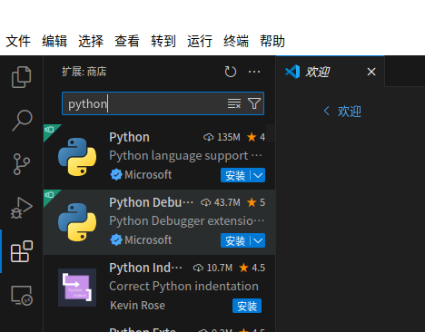

# VSCode远程环境开发指南

## 1.为什么要远程开发

办公电脑常常会因安装各种包和部署开发环境而变得混乱，导致项目开发中出现各种问题，重新安装环境并不现实。因此，许多开发者选择将开发环境与办公环境分离，通过远程连接开发环境来编码，确保办公电脑的整洁和高效。

## 2.为什么选择vscode

测试部主要使用 Python 和 Shell 进行开发。在众多 IDE 中，PyCharm 和 VSCode 是不可避免的选择，两者的对比如下：

| **对比项**  | **启动速度**                 | **功能集成**                             | **Python 支持**                           | **扩展定制**                 |
| ----------- | ---------------------------- | ---------------------------------------- | ----------------------------------------- | ---------------------------- |
| **VSCode**  | **轻量、启动快，占用资源少** | **核心功能简洁，大多数功能依赖插件支持** | **需安装 Python 扩展和调试插件**          | **丰富插件市场，可灵活定制** |
| **PyCharm** | **启动慢，占用资源多**       | **开箱即用的高级功能**                   | **原生支持 Python，专为 Python 开发设计** | **定制性较少，不够灵活**     |

**关键原因：VSCode 完全免费，而 PyCharm 的远程开发功能需要专业版，且专业版是收费的。**

## 3.配置步骤

### 1）下载安装

* **从应用商店下载**

* **官网下载：**[点我跳转](https://code.visualstudio.com/)

### 2）插件下载

第一步：安装简体中文插件

第二步：安装完成后点击右下角重启vscode

第三步：安装remote-ssh插件

插件市场搜索`remote-ssh`，点击安装

### 3）VSCode配置

第一步：`ctrl+shift+p`调出命令框，输入`remote-ssh:config`

第二步：配置远程环境信息

第三步：`ctrl+shift+p`调出命令框，输入`Remote-SSH:Settings`，**把**`Remote.SSH：Enable Agent Forwarding`的勾选去掉

### 4）免密配置

第一步：打开终端输入`ssh-keygen`，连续回车生成密钥

第二步：配置远程免密：

### 4）远程机器配置

第一步：安装`openssh-server`，专业版安装命令`sudo apt-get install openssh-server`，服务器版安装命令`yum install openssh-server`，安装完成后打开`/etc/ssh/sshd_config`，做如下修改

将`PermitRootLogin`前的注释去掉，同时将后面字段改为yes

将`AllowTcpForwarding `前的注释去掉，同时将后面字段改为yes

第二步：重启服务

`systemctl restart sshd`

## 4.连接远程

大功即将告成，重启vscode后，点击左侧边电脑图标，然后点击已配置的远程机器，开始链接~~~

会发现右下角开始链接远程并开始相关配置提示

进度条读完后，点击左侧边栏文件图标，即可打开远程项目进行开发啦！！

## 5.推荐插件

Python插件：Microsoft 提供的 Python 扩展，提供了强大的 Python 支持，包括代码补全、Linting、格式化等功能

black formatter：Python 代码格式化工具，能够自动格式化代码以符合 PEP 8 标准，使代码保持一致的风格

格式化快捷键：

* **Windows/Linux**‌: `Ctrl + Shift + I`
* **macOS**‌: `Cmd + Shift + F`

